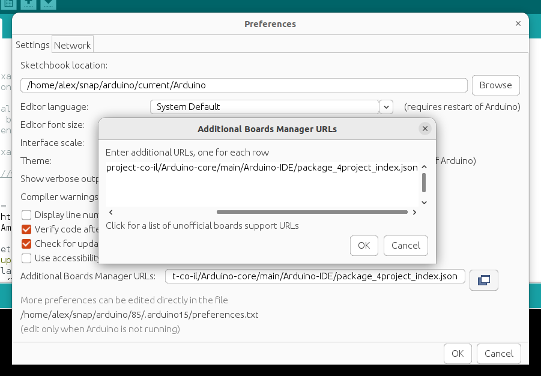
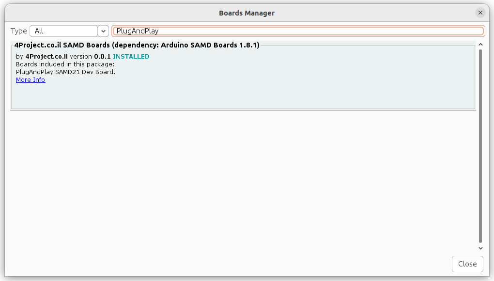
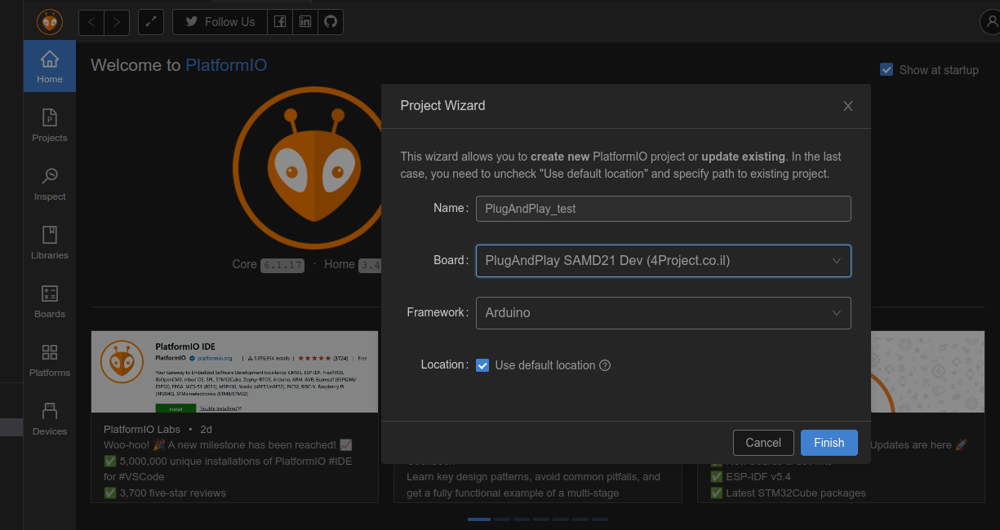

This repository contains all needed files to provide support for Arudino IDE and PlatformIO environments for the Plug-And-Play boards.

## Arduino IDE support
Assuming you already have the Arduino IDE installed.
If not, you can follow any good tutorial, here is [a SparkFun tutorial](https://learn.sparkfun.com/tutorials/installing-arduino-ide/all) as an example.

As described in [this tutorial](https://learn.sparkfun.com/tutorials/samd21-minidev-breakout-hookup-guide/setting-up-arduino), you need to add a line to the **Additional Board Manager URLs** field in **File** > **Preferences** menu.
Click on the 2-windows icon located after that field, a dialog with text box will appear.
Add a new line with the following location to that text box:\
`https://raw.githubusercontent.com/4project-co-il/Arduino-core/main/Arduino-IDE/package_4project_index.json`

Press OK to close the text box dialog and OK to close the **Preferences** window.

The rest is similar to the tutorial.
In the **Board Manager** search for `PlugAndPlay`, and you will find there an option to install the **4Project.co.il SAMD Boards**, which will include the PlugAndPlay boards as well.

## PlatformIO support
We strongly suggest to use VSCode with PlatformIO environment to have a more professional build environment compared to the Arduino IDE.\
VSCode provides you with a very professional IDE that speeds up your coding experience.\
PlatformIO is a VSCode plugin that provides compilation and programming of development boards in a similar way as it's done in Arduino IDE (buttons to compile and upload to the board).

Assuming you have already the VSCode and PlatformIO installed. There are many tutorials online.

PlatformIO have a built-in support for many popular boards. In order to use a custom board, such as PlugAndPlay board in our case, you will have to copy some files into PlatformIO environment and into your project directory.

### First step
First, locate your PlatformIO `core_dir`, where all the platform and environment files are stored.\
On Linux system it's generally the `~/.platformio` directory.\
On Windows it's `%HOMEPATH%\.platformio`.

Copy the content of the [PlatformIO](https://github.com/4project-co-il/Arduino-core/tree/main/PlatformIO) directory to the `core_dir` on your computer.\
There are 2 directories that have to be copied:\
`boards` that include the declaration files for the custom boards, 
and `variants` that include boards hardware definitions, such as enumeration of the pins, what pin will serve an the internal LED, memory mappings, communication instances and many more other definitions.

Restart the VSCode program if you had it open, to reload the changes.

Now, with the boards definitions in place, you can start a new PlatformIO project and select PlugAndPlay board from the list of supported boards.

### Second step
After you create a new project, copy the `boards` and `variants` directories from the PlatformIO `core_dir` to your project directory.

That's it. Now you can compile your code for the PlugAndPlay board and upload it to the development board from the PlatformIO environment.

